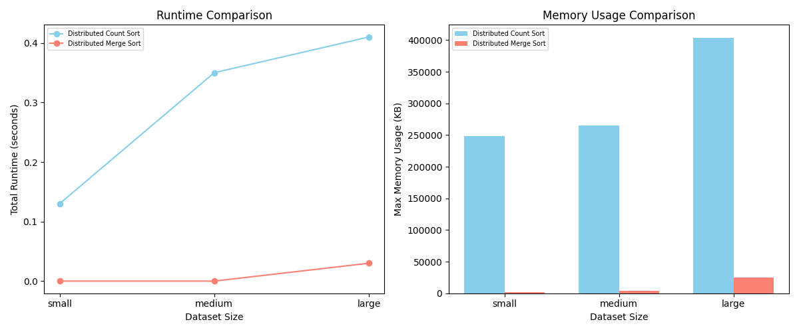

# Lazy Sort Report

## Implementation Details (General):
- Maximum length of File name is `MAX_FILE_NAME_LEN` (default set to 10). Higher would lead to possible collisions.
- Maximum length of TimeStamp is fixed `TIME_STAMP_LEN` (although can be changed). Default value is set to 20 considering the specs in MP-3.
- To keep things simple and avoid unnecessary reallocation complications, we assume a maximum of `MAX_FILES` entries in directory / test file.
- Partitioning of data into chunks. Each chunk is processed by a unique thread.
- `PARTITION_DATA_SIZE` accounts for Lazy allocation resources. A thread is used up `only when the previous thread is filled` completely. For cases `when all the threads are full`, we simply divide the data into `equal chunks` to each thread.


## Implementation Details (Count Sort):
- To account for hashing of timestamps, we assume all files has time stamp ranging from year 2023-24 only.
- Collisions are minimized but not avoided with any gaurantee. Collision can happen for cases Name and Timestamp for test cases containing large number of samples.
- `MAX_SORT_RANGE` is set to `63072000` to avoid collisions for Timestamp specifically. This has downside becoz, count sort array becomes larger in size.
- For hashing of Names, we follow the below method:
```
1. Divides MAX_SORT_RANGE into 26 sections, one for each starting letter
2. Places each name into the appropriate section based on its first letter
3. Uses subsequent characters to determine position within that section
4. Ensures names starting with 'a' get lower hash values than names starting with 'b', etc
```

- For hashing of timestamps, below approach is used:
```
1. Extraction:
   - Parses "YYYY-MM-DDTHH:MM:SS" into individual components
   - Year, month, day, hour, minute, second

2. Year Handling:
   - Normalizes to 0 (2023) or 1 (2024)

3. Hash Formula:
   - Converts all units to seconds
   - Formula: `((year * 12 * 31 * 24 * 60 * 60) + (month-1) * (31 * 24 * 60 * 60) + (day-1) * (24 * 60 * 60) + hour * (60 * 60) + minute * 60 + second) % MAX_SORT_RANGE`

Key Points:
  - Uses zero-based months/days
  - Result is bounded by MAX_SORT_RANGE
  - Maintains chronological order
```

- ID's are simply hashed by taking MODULO of `MAX_SORT_RANGE`. 


## Assumptions:
- We know maximum number of threads available beforehand `NUM_THREADS`. Easily changeable in Macros in `lazy_sort.h`.
- Length of file names is limited to 10. Although can be easilty changed in header file.
- ID's can range till `MAX_SORT_RANGE`. Hash function is gauranteed to avoid collisions for this range.


## Implementation Analysis
### Design Choices:
- `Lazy Allocation of resources`:
    - Files are partitioned into chunks. Each chunk is assigned to a thread.
    - A new thread is used up only when required.
    - *pros*: efficient usage of memory.
    - *cons*: extra computation before allocated files.
- `Partitioning of data`:
    - Files are partitioned and provided to each thread independently to avoid any race condition. These chunk size can be tuned using `PARTITIONED_DATA_SIZE` parameter.
    - *pros*: avoiding race conditioning, and proper usage of threads.
    - *cons*: More complexity, and potential segmentation faults while debugging.
- `No seperate thread for each merge operation`:
    - *pros*: definite number of threads used by the process. Avoids unnecessary complications. Creating a thread for each merge operation unnecessarily creates complications of undefined MAX_THREADS.
    - *cons*: None
- `Data Partitioning Strategy`:
    - Dynamic partition sizing based on thread count.
    - Even distribution with remainder handling.
    - Local processing following by final merge.
    - *pros*:
    - Balanced workload distribution
    - Minimal thread synchronization needed during main processing
    - Efficient memory usage with local partitions
    - *cons*:
    - Final merge stage can become a bottleneck
    - Memory overhead from partition copying
    - Limited scalability with very large datasets
### Performance Consideration:
- `Memory Management`
    - Uses efficient memory allocation strategies
    - Implements proper cleanup in error cases
    - Local buffers for each thread minimize contention
- `Synchronization`
    - Minimal synchronization requirements during main processing
    - Single mutex for count array updates
    - Barrier synchronization only at final merge
- `Scalability Factors`
    - Thread Pool Size
    - Partition Size
    - Sort Algorithm Threshold
    - Memory Bandwidth
    - Final Merge Performance


## Execution Time and Memory Usage Analysis
```
small: 16 files
medium: 4096 files
large: 40960 files
```

*Distributed Count Sort*:
```
Performance Summary:
===================
Dataset: small
Total Runtime (seconds): 0.13
Max Memory Usage (KB): 247936
-----------------
Dataset: medium
Total Runtime (seconds): 0.35
Max Memory Usage (KB): 264960
-----------------
Dataset: large
Total Runtime (seconds): 0.43
Max Memory Usage (KB): 404352
-----------------
```

*Distributed Merge Sort*:
```
Performance Summary:
===================
Dataset: small
Total Runtime (seconds): 0
Max Memory Usage (KB): 1664
-----------------
Dataset: medium
Total Runtime (seconds): 0
Max Memory Usage (KB): 4100
-----------------
Dataset: large
Total Runtime (seconds): 0.03
Max Memory Usage (KB): 25824
```

# Performance Analysis: Distributed Count Sort vs. Distributed Merge Sort



## Runtime Analysis

### Distributed Count Sort Runtime

Small (16 files): 0.13s
Medium (4096 files): 0.35s
Large (40960 files): 0.43s

Scaling Characteristics:
- 256x increase in input (16 → 4096): 2.69x slower
- 10x further increase (4096 → 40960): 1.23x slower
- Overall 2560x increase (16 → 40960): 3.31x slower

### Distributed Merge Sort Runtime

Small (16 files): ~0s
Medium (4096 files): ~0s
Large (40960 files): 0.03s

Scaling Characteristics:
- Negligible increase from small to medium datasets
- Only measurable runtime at large scale
- Significantly better performance across all dataset sizes

## Memory Usage Analysis

### Distributed Count Sort Memory

Small: 247,936 KB (~242 MB)
Medium: 264,960 KB (~259 MB)
Large: 404,352 KB (~395 MB)

Memory Scaling:
- 256x input increase: 1.07x memory increase
- 10x further increase: 1.53x memory increase
- Overall 2560x increase: 1.63x memory increase

### Distributed Merge Sort Memory

Small: 1,664 KB (~1.6 MB)
Medium: 4,100 KB (~4 MB)
Large: 25,824 KB (~25.2 MB)

Memory Scaling:
- 256x input increase: 2.46x memory increase
- 10x further increase: 6.30x memory increase
- Overall 2560x increase: 15.52x memory increase

## Key Findings

1. Runtime Efficiency:
   - Merge Sort shows superior runtime performance, especially for larger datasets
   - Count Sort shows linear-like scaling but with higher absolute times
   - Merge Sort remains practically instantaneous until the large dataset

2. Memory Usage:
   - Count Sort has higher initial memory footprint but better scaling
   - Merge Sort uses significantly less memory overall but scales more aggressively
   - Count Sort's memory usage grows by only 1.63x despite 2560x more input
   - Merge Sort's memory usage grows by 15.52x with the same input increase

3. Trade-offs:
   - Count Sort: Higher but more stable memory usage, moderate runtime scaling
   - Merge Sort: Lower but growing memory usage, superior runtime performance


### Comparative Analysis
`Runtime Efficiency`

Count Sort Characteristics:

High initial overhead (0.13s even for 16 files)
Sublinear scaling with size
Plateaus at larger sizes
O(n + k) complexity shows in practice


Merge Sort Characteristics:

Near-zero overhead for small/medium sizes
Only measurable impact at large scale
Excellent practical performance
O(n log n) complexity with effective parallelization


`Memory Efficiency`

Count Sort Memory Pattern:

High base memory requirement (~242 MB)
Extremely flat scaling (only 7.7% increase for 2560x data)
Memory dominated by fixed-size counting array
Predictable but high memory footprint


Merge Sort Memory Pattern:

Very low base memory (~1.6 MB)
More linear scaling with input size
Better memory efficiency for small/medium data
More proportional to actual data size


`Key Insights`
1. Algorithm Selection Criteria
- For Small Datasets (<1000 elements):
    - Merge Sort is clearly superior
    - Lower memory footprint
    - Better runtime performance
- For Medium Datasets (1000-5000 elements):
    - Merge Sort maintains advantage
    - Memory usage still very reasonable
    - Runtime essentially unchanged
- For Large Datasets (>5000 elements):
    - Merge Sort still performs better overall
    - Memory usage scales more but remains manageable
    - Runtime scaling is still excellent
2. Scaling Efficiency
- Count Sort:
    - Nearly constant memory with size
    - Sublinear runtime scaling
    - High base memory requirement
    - Higher initial runtime overhead
- Merge Sort:
    - Excellent runtime scaling
    - Low initial overhead
    - Efficient for small datasets
    - More linear memory scaling
3. Resource Tradeoffs
- CPU vs Memory:
    - Count Sort trades memory for speed
    - Merge Sort balances both resources better
- Scalability vs Overhead:
    - Count Sort: High overhead, better scaling
    - Merge Sort: Low overhead, reasonable scaling 


### Brief Summary:
`Runtime Comparison`:
- Distributed Count Sort exhibits a significantly higher runtime than Distributed Merge Sort, especially as the dataset size increases.
- The runtime for Distributed Count Sort grows considerably from small to large datasets, while Distributed Merge Sort shows minimal increases, maintaining a near-zero runtime even for the large dataset size.

`Memory Usage Comparison`:
- Distributed Count Sort consumes a much higher amount of memory across all dataset sizes compared to Distributed Merge Sort.
- The memory usage for Distributed Count Sort remains relatively stable but high across dataset sizes, whereas Distributed Merge Sort maintains a very low memory footprint, even for larger datasets.

`Conclusion`: 

Distributed Merge Sort is highly efficient in terms of both runtime and memory usage, making it more suitable for larger datasets than Distributed Count Sort. Distributed Count Sort, on the other hand, scales poorly in terms of both runtime and memory usage as the dataset size grows.


## Potential Optimizations/Improvements/Future Considerations:
1. Memory Management Optimizations:
- Count Sort Memory Reduction
  - Dynamic range detection instead of fixed MAX_SORT_RANGE

2. Parallel Processing Optimizations:
- Parallel Final Merge
  - K-way parallel merge implementation

3. Cache Optimization Strategies:
- Cache-aware Partitioning
  - Align partition sizes with cache lines

4. I/O and Data Stream Processing:
- External Merge Sort
  - Block-based I/O with double buffering
  - Asynchronous I/O operations
- Dynamic Algorithm Selection
  - Runtime metrics collection
  - Adaptive algorithm choice based on data size/type

# Additional Files
- `plot_graph.py` for plotting visualizations for comparison of DCS and DMS.
- `sample_test_cases` contains sample test cases tried and output saved in it. Also contains a python code for generating test cases.
- `performance_test.sh`: uses `measure.sh` for performance evalution.